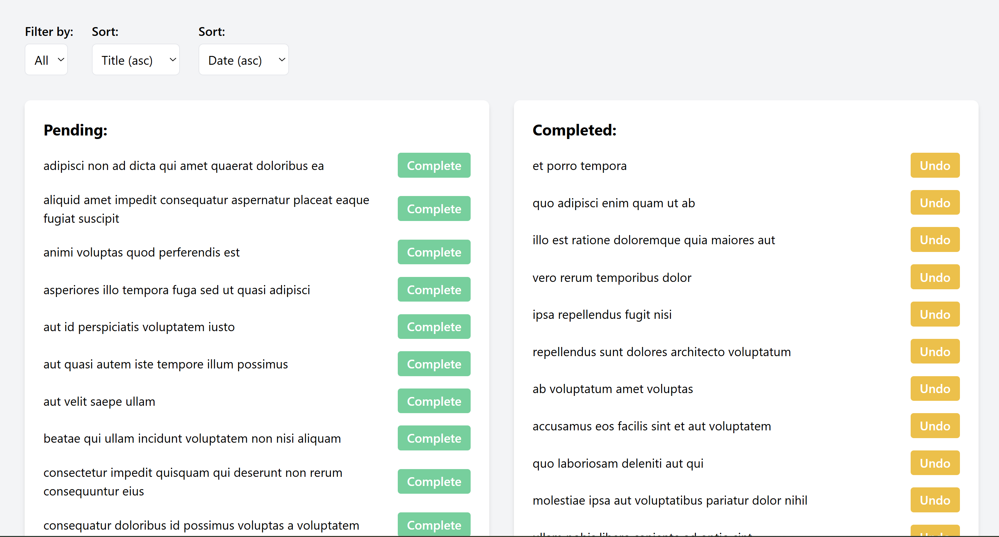

# Todo React Tailwind App

## Application UI:


## Technologies used for the project creation:
1. React @18.3.1
2. Tailwindcss @3.4.17
3. PostCSS @8.5.3
4. Autoprefixer @10.4.21
5. Vite @5.4.18
6. JSONPlaceholder API — Mock REST API for testing and prototyping.

## Prerequisites:
1. Node.js @22.15.0
2. npm @11.3.0
3. VSCode @1.99.3/ higher
   
## Setup
1. Install dependencies:
```bash
npm install
```
2. Run the development server:
```bash
npm run dev
```
3. Open: ```http://localhost:8080```

## WARNING!
In case you couldn't start the app and get a **warning about loading the ES module**:
1. Go to *package.json* and add *"type": "module"*
2. Run the server again: ```npm run dev```
3. In case the app couldn't be started either - go to *postcss.config.js* and rename it to *postcss.config.mjs*
4. Run the server again: ```npm run dev```
5. Now everything should work properly :D
